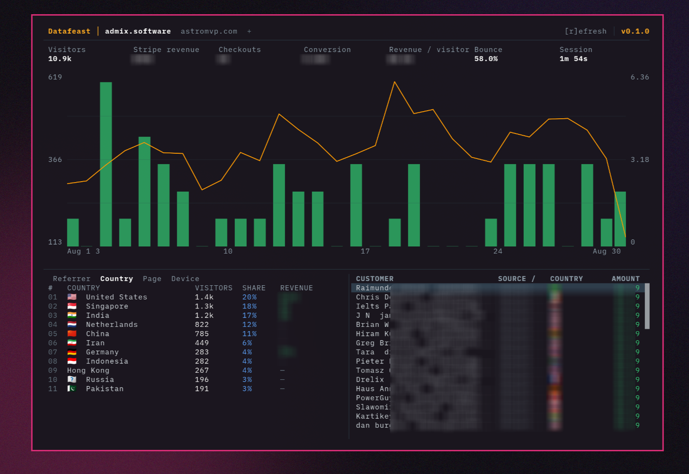

# Datafeast

Datafeast is a keyboard-driven Google Analytics and Stripe revenue dashboard for the terminal, desktop, and browser. It combines acquisition data with completed Checkout Sessions in a DataFast-inspired workspace built on the open-source Gloomberb runtime.



This repository is the complete application—not an add-on plugin. It includes the executable, renderer entry points, default workspace, API clients, shared state, charts, tables, build scripts, tests, and desktop configuration.

## Dashboard

The default workspace includes:

- A synchronized 30-day chart with an orange Google Analytics traffic line and green Stripe checkout columns
- Visitors, Stripe revenue, checkouts, conversion, revenue per visitor, bounce rate, and average session duration
- Referrer, country, page, and device traffic breakdowns
- Revenue from one-time Checkout payments and paid subscription invoices
- Revenue attribution from Stripe Checkout and invoice metadata
- A sortable and CSV-exportable Checkout table with customer, source, country, status, and amount
- Deterministic demo data when credentials are absent

Press `r` in any analytics pane to refresh its shared snapshot. Keyboard and mouse navigation work across the terminal, desktop, and browser renderers.

## Run locally

Datafeast requires [Bun](https://bun.sh/) 1.3 or newer.

```bash
bun install
cp .env.example .env
bun run start
```

The compatibility executable can also launch the product directly:

```bash
bun bin/signalbase
```

The app opens with demo data by default. Set these values in `.env` for live native-terminal or desktop data:

```bash
GOOGLE_ANALYTICS_PROPERTY_ID=123456789
GOOGLE_ANALYTICS_ACCESS_TOKEN=your_oauth_access_token
STRIPE_SECRET_KEY=sk_test_or_live_key
```

For multiple websites, copy `analytics-sites.example.json` to
`~/.signalbase/analytics-sites.json`. Give every site its own GA4 property ID
and either a protected Stripe key file or an environment-variable reference. A
single Google service account can read several GA4 properties after its
`client_email` is added as a Viewer on each property. Keep credential files at
mode `600`; never put live keys in a committed site profile.

The Google token needs the `analytics.readonly` OAuth scope. The app reads the
previous 30 days through the GA4 Data API, fetches completed Stripe Checkout
Sessions, and includes paid subscription invoices from the same period. The
browser build deliberately remains in demo mode so credentials are never
bundled into client JavaScript.

For revenue attribution, attach optional metadata to Checkout Sessions:

```text
source=google / organic
country=United States
```

`utm_source` is accepted as an alternative to `source`. Sessions without
source metadata appear as `Unattributed`, which deliberately remains separate
from Google Analytics' genuine `Direct / None` traffic bucket. Country falls
back to Stripe's collected billing or shipping address before metadata.

## Commands

```bash
bun run start                  # terminal app
bun run web:build              # browser bundle
bun run desktop:view:build     # desktop renderer bundle
bun run build                  # standalone TUI binary
bun test                       # test suite
bun run typecheck              # all TypeScript targets
```

Within the command palette, `analytics`, `ga`, and `signalbase` all restore the analytics workspace. The inherited Gloomberb panes and command system remain available for extending the workspace.

## Application structure

The analytics product lives in `src/plugins/builtin/web-analytics/` as a first-party application module:

- `client.ts` calls GA4 and Stripe, normalizes the responses, merges daily series, and caches snapshots
- `store.ts` shares one refreshable snapshot across every analytics pane
- `panes.tsx` renders the overview chart, acquisition tabs, and Checkout table
- `index.ts` defines the default dashboard layout, pane registrations, and CLI launch command
- `demo.ts` supplies stable sample data for onboarding and browser previews

Datafeast starts this workspace from the TUI, browser renderer, and desktop renderer. Existing storage namespaces, deep links, and binary names remain compatible with Signalbase installs.

## Foundation and license

Datafeast is a full application distribution based on [Gloomberb](https://github.com/gloom-sh/gloomberb). Its renderer-neutral pane system, charts, tables, layouts, command palette, and optional finance modules form the application foundation.

Released under the MIT License. See [LICENSE](LICENSE).
